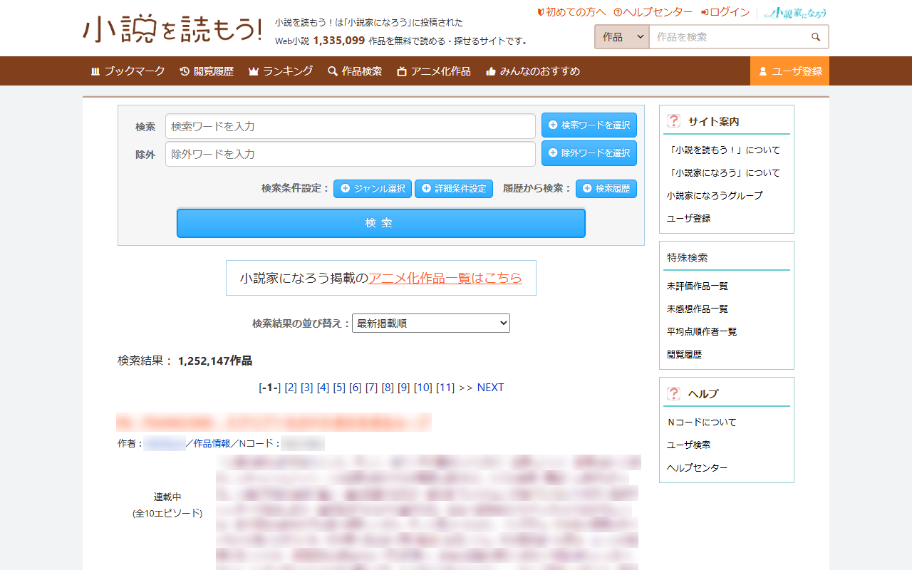
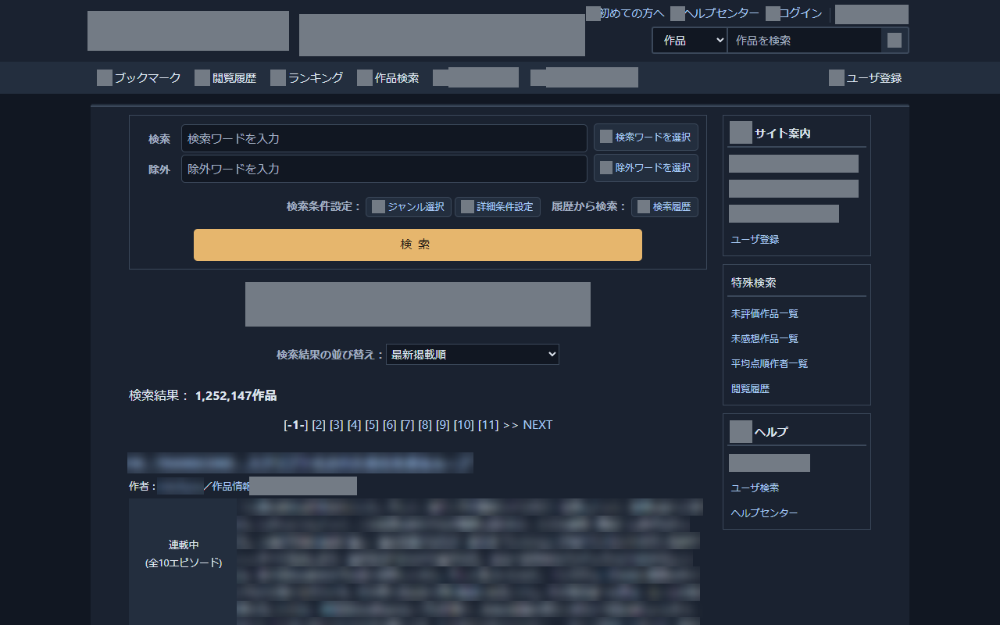
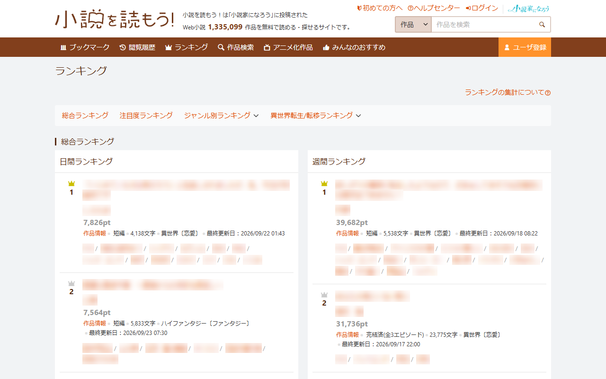
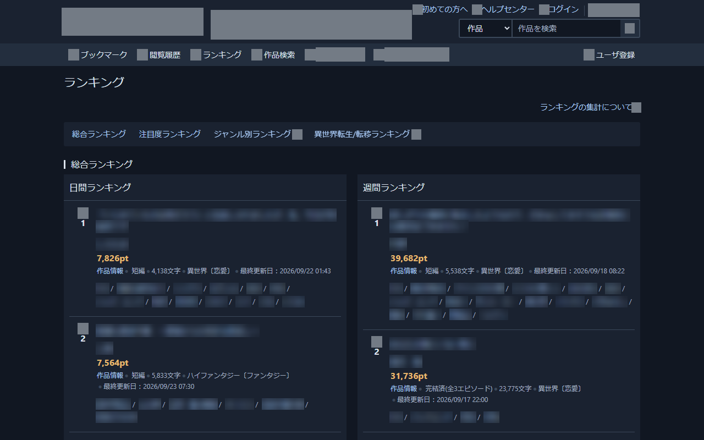
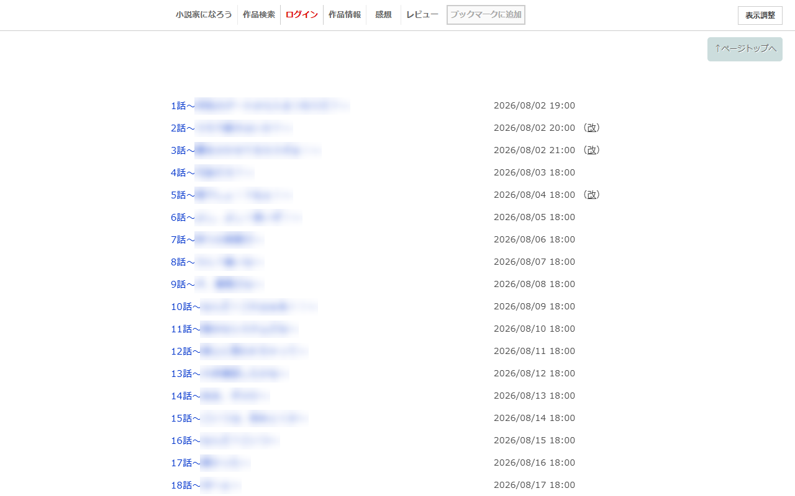
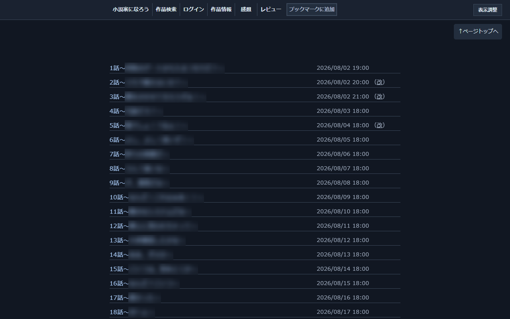
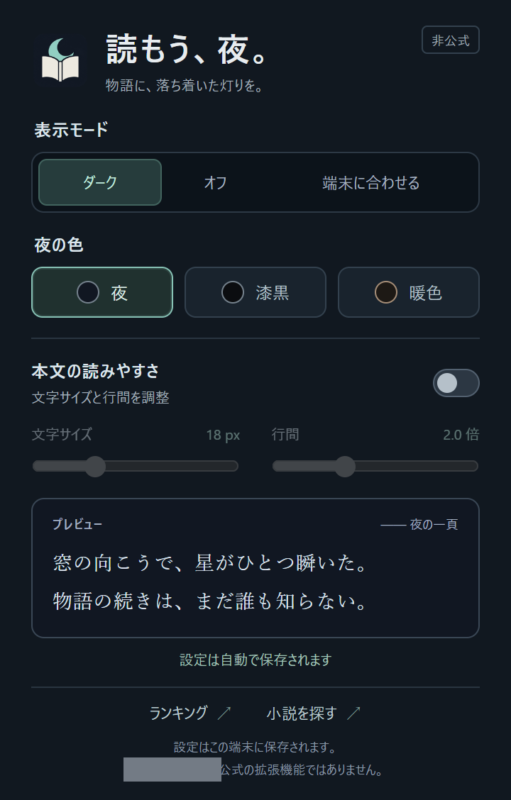

<p align="center">
  
</p>

# 読もう、夜。

**小説を探すときも、読むときも。落ち着いたダークモードを。**

「小説を読もう！」のランキング・検索と、「小説家になろう」の小説目次・本文に対応する、非公式のChrome拡張機能です。元のレイアウトを保ち、背景・文字・入力欄を読みやすい配色に切り替えます。

[](https://github.com/check5004/yomou-syosetu-darkmode/actions/workflows/ci.yml)
[](https://github.com/check5004/yomou-syosetu-darkmode/releases/latest)

**[最新版をダウンロード](https://github.com/check5004/yomou-syosetu-darkmode/releases/latest)** · [変更内容](RELEASE_NOTES.md) · [プライバシー](PRIVACY.md)

開発予定：[ToDo](TODO.md) · [Chromeウェブストア公開準備](docs/CHROME_WEB_STORE.md) · [掲載画像の検証](docs/STORE_ASSET_VALIDATION.md)

## 特長

- **3種類の配色**：青みのある「夜」、黒に近い「漆黒」、柔らかな「暖色」。
- **簡単な切り替え**：常時ダーク、オフ、端末の明暗設定への追従。
- **本文の調整**：文字サイズと行間を必要なときだけ変更。
- **すぐ反映**：設定変更は開いている対応ページに反映。設定は端末内に保存。
- **軽量な構成**：追加API権限は設定保存用の `storage` のみ。外部通信やアクセス解析はありません。

## ビフォー／アフター

左が拡張機能をオフにしたサイト本来の表示、右が「夜」の配色を有効にした表示です。同じページ・同じ位置で比較しています。画像をクリックすると原寸で確認できます。

### 検索

| 無効（サイト本来の表示） | 有効（夜） |
| --- | --- |
| [](assets/store/screenshots/01-search-off.png) | [](assets/store/screenshots/01-search.png) |

### ランキング

| 無効（サイト本来の表示） | 有効（夜） |
| --- | --- |
| [](assets/store/screenshots/02-ranking-off.png) | [](assets/store/screenshots/02-ranking.png) |

### 小説目次

| 無効（サイト本来の表示） | 有効（夜） |
| --- | --- |
| [](assets/store/screenshots/03-toc-off.png) | [](assets/store/screenshots/03-toc.png) |

実サイトの保存済みページから撮影し、作品名・作者名・あらすじなどの文字だけを両側で同じようにぼかしています。撮影時は広告を省略しています。ぼかしや広告非表示は本拡張機能の機能ではありません。[画像の作成方法](docs/STORE_ASSET_VALIDATION.md)

## インストール

デスクトップ版Chrome 109以降が対象です。ビルドやNode.jsのインストールは不要です。Chromeウェブストアへの登録はしていません。

1. **[最新版のReleases](https://github.com/check5004/yomou-syosetu-darkmode/releases/latest)** を開きます。
2. **Assets** の `yomou-darkmode-<バージョン>.zip` をダウンロードし、削除しない場所へ展開します。
3. Chromeのアドレスバーに `chrome://extensions` と入力します。
4. 右上の **デベロッパーモード** をオンにします。
5. **パッケージ化されていない拡張機能を読み込む** を押し、展開した **`manifest.json` があるフォルダー** を選びます。
6. 開いている対象サイトのページを再読み込みします。

Chromeの拡張機能メニューから「読もう、夜。」を固定すると、設定をすぐ開けます。`Source code (zip)` は開発用ソース一式です。通常の導入には `yomou-darkmode-<バージョン>.zip` を使ってください。

### ソースコードから導入する場合

このリポジトリをcloneまたはダウンロードし、上の手順5で **`extension` フォルダー** を選びます。プロジェクト全体のフォルダーではありません。

### 更新・削除

- **更新**：Chromeを閉じ、新版ZIPの内容で導入済みフォルダー内のファイルを置き換えます。Chromeを開き、`chrome://extensions` で拡張機能の更新ボタンを押して、対象ページを再読み込みします。同じフォルダーを使うと設定を引き継げます。
- **一時停止**：拡張機能の設定画面で「オフ」を選びます。
- **削除**：`chrome://extensions` で「削除」を選びます。保存した設定も削除されます。

ZIP版には自動更新機能がありません。新しいバージョンはReleasesから取得してください。

## 対応ページ

| ページ | 対象 |
| --- | --- |
| ランキング | ランキングTOP、総合・ジャンル別、日間・週間・月間など |
| 検索 | 検索フォーム、詳細条件、検索結果、サイドバー |
| 小説目次 | あらすじ、章・エピソード一覧、更新日時、ページ移動 |
| 小説本文 | 連載・短編、前書き・後書き、ルビ、前後のエピソードへの移動 |

対応サイトのトップページや作品情報にも共通の配色を適用します。作者マイページ、ログイン画面、感想サイトは対象外です。

## 設定



| 項目 | 動作 |
| --- | --- |
| ダーク | 常にダークモード。初期設定です。 |
| オフ | 拡張機能の配色・文字調整を解除して、サイト本来の表示に戻します。 |
| 端末に合わせる | OS／ブラウザーの明暗設定に追従します。 |
| 夜・漆黒・暖色 | ダークモード中の配色を選びます。 |
| 本文の読みやすさ | 本文・前書き・後書きの文字サイズを14〜28px、行間を1.6〜2.8倍で調整します。 |

本文の文字調整は初期状態ではオフです。オフの間はサイト側の文字設定を使います。オンにすると、ダークモード中だけ拡張機能の文字設定が適用されます。

## 権限・プライバシー

- `storage`：表示モード・配色・文字設定を `chrome.storage.local` に保存します。
- 対応ページで、同梱したCSSとJavaScriptを実行します。
- 閲覧履歴・訪問URL・小説本文・入力内容を収集、保存、送信しません。
- サーバーへの通信、アクセス解析、外部ライブラリの読み込みはありません。

詳細は [プライバシーポリシー](PRIVACY.md) を参照してください。

## 表示について

- 画像は反転しません。別ドメインの広告iframeや、画像に描かれた白い背景は元のままです。
- サイト内の「表示調整」で選んだ背景色より、この拡張機能の配色が優先されます。「オフ」にするとサイトの設定へ戻ります。
- 他のダークモード拡張機能と同時に使うと、配色が競合する場合があります。
- インストール直後や拡張機能の更新後は、対象ページを再読み込みしてください。
- サイト側の変更で配色が崩れた場合は、[Issues](https://github.com/check5004/yomou-syosetu-darkmode/issues) に対象URLと状況を記載してください。

## 開発・検証

拡張機能に実行時の依存パッケージはありません。開発には **Node.js 24以降** を使用します。`npm install` は不要です。

```sh
npm test
npm run check
npm run package
```

npmを使わない場合：

```sh
node --test tests/settings.test.cjs tests/content.test.cjs tests/package.test.mjs
node scripts/check.mjs
node scripts/package.mjs
```

配布物は `dist/` に生成されます。ZIPを展開すると直下に `manifest.json` があり、そのままChromeへ読み込めます。検証した範囲は [VALIDATION.md](VALIDATION.md) にまとめています。

### GitHub ActionsでのZIP配布

[CI / Releaseワークフロー](.github/workflows/ci.yml) がテスト・ファイル検証・ZIP生成を行います。通常のpushとPull Requestでは検証用アーティファクトを作成し、`v` で始まるバージョンタグのpushでGitHub ReleasesへZIPとSHA-256チェックサムを公開します。

新版を公開する手順：

1. `extension/manifest.json` と `package.json` のバージョンを同じ値に更新します。
2. `RELEASE_NOTES.md` の先頭を `# v<バージョン>` にし、新版の変更内容と導入手順を記載します。
3. テストを実行し、変更をコミットしてpushします。
4. 同じコミットにバージョンタグを付けてpushします。

```sh
git tag v1.0.1
git push origin v1.0.1
```

タグとマニフェストのバージョンが一致しない場合、公開処理は失敗します。公開状況は [Actions](https://github.com/check5004/yomou-syosetu-darkmode/actions) と [Releases](https://github.com/check5004/yomou-syosetu-darkmode/releases) で確認できます。公開済みタグの再実行は配布物が同一の場合のみ成功し、異なるZIPへの置き換えは行いません。

### ファイル構成

```text
extension/           Chromeに読み込む拡張機能
  manifest.json      対象ドメイン・権限・バージョン
  theme.css          ページ種別ごとのダーク配色
  content.js         設定とOS変更の反映
  settings.js        設定の検証・端末内保存
  popup.*            日本語の設定画面
  icons/             Chrome用アイコン
assets/              アイコン原画像と生成記録
docs/screenshots/    設定画面のスクリーンショット
scripts/             検証・ZIP生成
tests/               回帰テスト
.github/workflows/   CI・リリース自動化
```

アプリアイコンは本と月をモチーフに作成しました。[原画像](assets/app-icon.png) と [生成方法・プロンプト](assets/ICON.md) を同梱しています。

---

本拡張機能は株式会社ヒナプロジェクトおよび「小説家になろう」「小説を読もう！」の公式製品ではありません。
