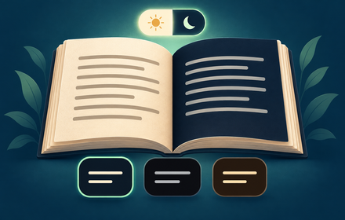

# Chromeウェブストア用素材

更新日：2026-09-27。ストアへの提出はまだ行っていません。[作成方法と確認状況](../../docs/STORE_ASSET_VALIDATION.md)も参照してください。

## スクリーンショット

検索・ランキング・小説目次の3画面について、有効・無効の2状態を用意しています。READMEでは無効を左、有効を右に並べて比較します。

| 対象画面 | 無効（サイト本来の表示） | 有効（夜） |
| --- | --- | --- |
| 検索 | [01-search-off.png](screenshots/01-search-off.png) | [01-search.png](screenshots/01-search.png) |
| ランキング | [02-ranking-off.png](screenshots/02-ranking-off.png) | [02-ranking.png](screenshots/02-ranking.png) |
| 小説目次 | [03-toc-off.png](screenshots/03-toc-off.png) | [03-toc.png](screenshots/03-toc.png) |

撮影元は、既にローカル保存していた実サイトのHTML・CSSです。表示に不足していた静的素材6点（ロゴ3点・フォント2点・ヘルプアイコン）を補い、拡張機能 v1.1.0 の実際の配色コードを適用して1280×800で描画します。現在公開中のページをそのまま撮影したものではありません。

作品名・作者名・あらすじ・章やエピソードの見出しが描画される範囲を取得し、その文字の範囲だけにCSSのぼかしを重ねて撮影します。検索条件やボタンなど、機能を伝えるためのUIとレイアウトは残します。

元HTML・CSSと未加工画像はGit管理対象外で保管し、このフォルダーでは文字をぼかした画像だけを公開します。各画像は1280×800です。[有効状態の検証データ](screenshots/verification.json)・[無効状態と比較の検証データ](screenshots/before-after-verification.json)

無効状態は拡張機能の設定を「オフ」にして撮影します。反転や画像の色変換は行わず、サイト本来のCSSによる表示を使います。作品の文字を隠す範囲とスクロール位置は有効・無効でそろえています。

## 紹介画像

- 提出用：[promo-440x280.png](promo-440x280.png) — 440×280、RGB PNG、透過なし。
- 原画像：[promo-original.png](promo-original.png) — 1572×1001。
- [生成プロンプトと使用ツール](PROMPT.md)。実在作品・第三者ロゴ・サイト画面は使っていません。

紹介画像は明暗切り替えと3配色を伝えるイラストです。今回のスクリーンショット差し替えでは変更していません。
